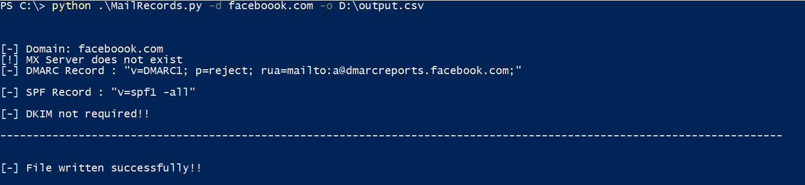

# MailRecords.py
Python script for checking Mail Authentication Records 
## Usage: ##

python3 MailRecords.py -d domain.tld -o Output_file 
python3 MailRecords.py -D domain.txt -o Output_file [optional parameter]

--------------------------------------------------------------------------------------------------------------------------------------------------------------------------------

The script will check for all the mail authentication records like MX, SPF, DMARC and DKIM. The DKIM record is verfied using the default selectors. 

The output is analysed as follow:
 
* NO MX Record for the domain : In this case the domain is not used for email purposes. For such domains the ideal value of SPF and DMARC for spoofing prevention should be :
   * "v=spfv1 -all" : This ensures that no server can send email for the domain.
   * "v=DMARC1; p=reject; rua=mailto:admin@domain.tld" : Mail is rejected on receiving end and report is generated and sent to email addreess specified.
   * DKIM for such domain is not required as it won't be used in communication

* MX Record is valid: In this case check for SPF and DMARC values for predicting if the mail can be spoofed.
   * Check for SPF issues like more than 10 lookups, void lookups and syntax errors
   * The DMARC value can be following:
     * p=none : This mode means the DMARC is in monitoring mode. If the SPF and DKIM fails, reports would be generated email specified in record. Spoofing is possible here.
     * p=quarantine : If DKIM and SPF fails, mail goes to spam folder.
     * p=reject : This is the ideal value that should be opted for best security. The email would be rejected and report would be generated and sent to specified email.
   * DKIM field may be verified using the selectors. If the script is unable to find DKIM, use custom selectors or find selector using email header analysis of emails received from the people of that domain.

